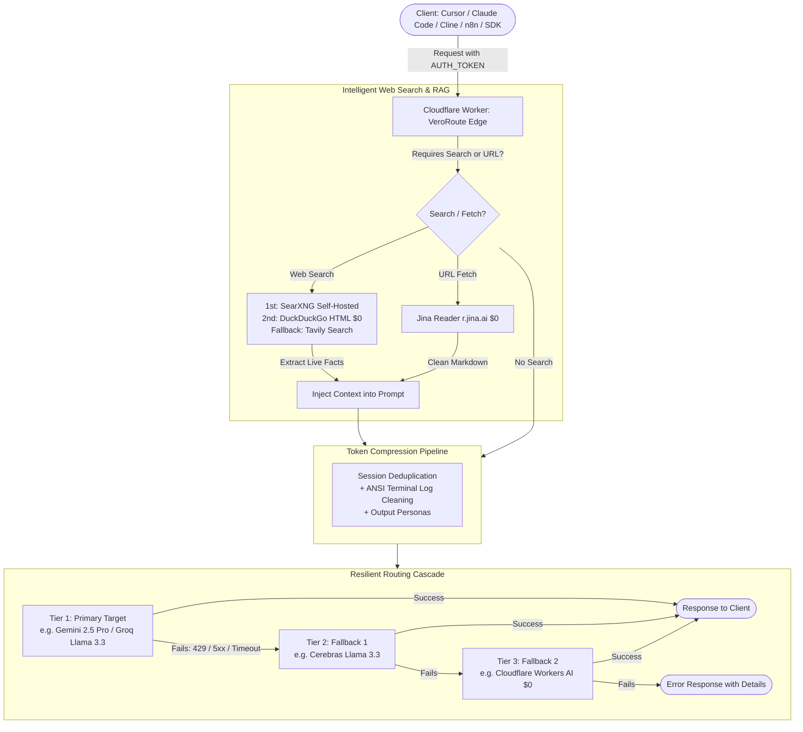

<div align="center">

# ⚡ VeroRoute Edge

### Aerodynamic Serverless AI Gateway & Smart Router for Cloudflare Workers
### Gateway de IA Serverless Aerodinâmico e Roteador Inteligente para Cloudflare Workers

[](https://deploy.workers.cloudflare.com/?url=https://github.com/samucamg/veroroute-edge)

[](https://www.typescriptlang.org/)
[](https://workers.cloudflare.com/)
[](https://hono.dev/)
[](#-endpoint-matrix)
[](#-endpoint-matrix)
[](LICENSE)

**[🇺🇸 English](#english) · [🇧🇷 Português](#portugues)**

</div>

---

<a id="english"></a>
# 🇺🇸 English

## ✨ Overview

**VeroRoute Edge** is an edge-native AI gateway and smart router that runs on **Cloudflare Workers (V8 Isolates)**. Inspired by the routing resilience of **OmniRoute** and the token-economy architecture of **VeroRoute**, it delivers low-latency AI proxy routing with zero dedicated servers.

**Key capabilities:**
- 🔄 **Resilient Cascade** — automatic fallback on HTTP 429/5xx with per-key cooldowns persisted in Cloudflare KV
- 🌐 **Dual API Compatibility** — OpenAI + Anthropic specification support (chat completions, messages, responses)
- 🖼️ **Multimodal Bridge** — automatic image transcription for text-only models via Gemini/Workers AI
- 🔍 **Real Free-Tier RAG** — Search-Augmented Generation with SearXNG, DuckDuckGo HTML, Tavily, Jina Reader
- 🎵 **Audio & Images** — TTS, transcription, image generation via Workers AI (FLUX)
- 🛡️ **Mandatory Auth** — fail-closed AUTH_TOKEN with virtual API keys and admin dashboard
- 🧰 **Tool Calling Emulation** — adds function-calling to models that don't support it natively

> **Works out of the box with zero API keys** — Cloudflare Workers AI (free tier: 10,000 neurons/day) and DuckDuckGo HTML search ($0) are built in. Add provider keys only for the models you want.



---

## 🚀 One-Click Deploy

The fastest way to deploy your own global AI gateway. No local terminal required:

<div align="center">

[](https://deploy.workers.cloudflare.com/?url=https://github.com/samucamg/veroroute-edge)

</div>

### Step-by-Step After Clicking Deploy:

1. **Click** the Deploy button above and authorize Cloudflare to fork the repository.
2. Cloudflare builds and deploys the Worker globally across **300+ edge locations**.
3. **Create 2 KV Namespaces** in the Cloudflare dashboard:
   - Go to **Workers & Pages → KV** → **Create a namespace**
   - Create `veroroute-edge-OMNI_CACHE` and `veroroute-edge-OMNI_KEYS`
4. **Bind KV** to your Worker:
   - Go to **Workers & Pages → veroroute-edge → Settings → Bindings**
   - Add KV Namespace binding: `OMNI_CACHE` → your cache namespace
   - Add KV Namespace binding: `OMNI_KEYS` → your keys namespace
5. **Set your AUTH_TOKEN** (mandatory, the gateway won't work without it):
   - Go to **Settings → Variables and Secrets → Add**
   - Name: `AUTH_TOKEN`, Type: **Secret**, Value: a strong password (min 20 chars, uppercase + lowercase + number + special char)
6. **(Optional)** Add API keys as secrets for the providers you want:
   - `GEMINI_API_KEYS`, `GROQ_API_KEYS`, `CEREBRAS_API_KEYS`, `OPENAI_API_KEYS`, etc.
   - Skip this step to use only the free Cloudflare Workers AI models.
7. **Done!** Access your gateway at `https://veroroute-edge.<your-subdomain>.workers.dev`

### Alternative: CLI Deploy (Wrangler)

```bash
# Clone
git clone https://github.com/samucamg/veroroute-edge.git
cd veroroute-edge
npm install

# Create KV namespaces
npx wrangler kv:namespace create OMNI_CACHE
npx wrangler kv:namespace create OMNI_KEYS

# Paste the returned IDs into wrangler.jsonc

# Set mandatory auth token
npx wrangler secret put AUTH_TOKEN

# Deploy
npx wrangler deploy
```

---

## 🗺️ Endpoint Matrix

| Method | Endpoint | Compatibility | Description |
|---|---|---|---|
| `GET` | `/` | Gateway | Visual Glassmorphism Dashboard & Playground |
| `GET` | `/health` | Gateway | Health check, architecture status and engine version |
| `GET` | `/v1/models` | OpenAI | Unified active models catalog with pricing and context lengths |
| `POST` | `/v1/chat/completions` | OpenAI | Chat, vision, tool calling & SSE streaming with cascade |
| `POST` | `/v1/responses` | OpenAI | Structured Responses API with reasoning support |
| `POST` | `/v1/messages` | Anthropic | Native Anthropic Messages (Claude Code CLI, Cline, Cursor, Roo Code) |
| `POST` | `/v1/images/generations` | OpenAI | Image generation via Workers AI (FLUX) with fallback |
| `POST` | `/v1/images/edits` | OpenAI | Image editing and variation endpoint |
| `POST` | `/v1/audio/speech` | OpenAI | Multi-engine text-to-speech (Workers AI / OpenAI) |
| `POST` | `/v1/audio/transcriptions` | OpenAI | Audio transcription via Workers AI Whisper |
| `POST` | `/v1/audio/translations` | OpenAI | Audio translation to English |
| `POST` | `/v1/search` | Gateway | Dedicated web search hub (SearXNG → DuckDuckGo → Tavily) |
| `POST` | `/v1/web/fetch` | Gateway | URL-to-Markdown scraper via Jina Reader (`r.jina.ai`) |
| `GET` | `/api/mcp/sse` | MCP Server | Model Context Protocol SSE transport |
| `POST` | `/api/mcp/messages` | MCP Server | MCP tool execution via JSON-RPC 2.0 |

---

## 🔍 Web Search & RAG: Real Free-Tier Providers

| Provider | Type | Free Tier | Setup | Credit Card? |
|---|---|---|---|:---:|
| **SearXNG** | Search | **100% Free ($0)**, Unlimited | Self-hosted via included [Docker Compose / Portainer](deploy/searxng/) | ❌ **No** |
| **DuckDuckGo HTML** | Search | **100% Free ($0)**, Unlimited | Native edge scraper, zero keys needed | ❌ **No** |
| **Jina Reader (`r.jina.ai`)** | Web Fetch | **100% Free ($0)**, Unlimited | Converts any webpage to clean Markdown | ❌ **No** |
| **Tavily Search** | Search | **1,000 queries/month free** | Free key at [tavily.com](https://tavily.com) | ❌ **No** |

---

## 🐳 Self-Hosted SearXNG (Docker & Portainer Stack)

Included in [deploy/searxng/](deploy/searxng/):

### Option 1: Docker Compose (CLI)
```bash
cd deploy/searxng
docker compose up -d
```

### Option 2: Portainer Stack (Web UI)
1. In Portainer, go to **Stacks** → **Add stack**.
2. Name: `searxng-gateway`.
3. Paste contents of [`deploy/searxng/portainer-stack.yml`](deploy/searxng/portainer-stack.yml).
4. Click **Deploy the stack**.
5. Set `SEARXNG_URL` in your Worker:
   ```jsonc
   "SEARXNG_URL": "http://YOUR_SERVER_IP:8080"
   ```

---

## ⚙️ Environment Variables & Secrets

> 💡 **`AUTH_TOKEN` is required; all other API keys are optional.**
> You do **NOT** need to configure every provider. Providing just **one single API key** is enough (or none at all, relying on the built-in **free Cloudflare Workers AI** and **DuckDuckGo HTML search**). The gateway routes and falls back across whichever providers you configure.

### 🔒 Secrets & API Keys (`.dev.vars` / Cloudflare Secrets)
*Set only what you plan to use:*
| Secret / Key | Required? | Description |
|---|:---:|---|
| **`AUTH_TOKEN`** | **Required** | Master bearer token to authenticate all API and admin requests. The gateway returns 503 if unset. Must be min 20 chars with uppercase, lowercase, number, and special character. |
| **`GEMINI_API_KEYS`** | Optional | Google Gemini API keys (comma-separated for pool rotation). |
| **`GROQ_API_KEYS`** | Optional | Groq Cloud API keys for ultra-fast Llama 3.3. |
| **`CEREBRAS_API_KEYS`** | Optional | Cerebras Cloud API keys (2,000+ tokens/s). |
| **`OPENAI_API_KEYS`** | Optional | Official OpenAI keys for GPT or audio fallbacks. |
| **`TAVILY_API_KEYS`** | Optional | Tavily web search API key (1,000 free queries/month). |

### 🌐 Public Variables (`wrangler.jsonc` `vars`)
| Variable | Default | Description |
|---|---|---|
| **`SEARXNG_URL`** | `""` (empty) | URL of your self-hosted SearXNG (e.g. `http://your-server-ip:8080`). Empty = DuckDuckGo HTML ($0 free). |
| **`DEFAULT_ROUTING_STRATEGY`** | `priority` | Routing strategy (`priority`, `random`, `lowest-cost`, `weighted`). |
| **`ENABLE_MODALITY_BRIDGE`** | `true` | Automatic vision-to-text bridge via Gemini / Workers AI. |
| **`ENABLE_CONTEXT_COMPRESSION`** | `true` | Token saver: message deduplication and terminal log cleanup. |
| **`ENABLE_JINA_READER`** | `true` | Clean Markdown web fetcher via `r.jina.ai` ($0 free). |

---

## 🔐 Antigravity OAuth & GitHub Secret Scanning

GitHub blocks commits containing Google OAuth secrets (`GOCSPX-...`). To keep your repo 100% clean:

1. **Via Admin Dashboard** — Go to the **Antigravity OAuth** tab, enter your Google Cloud Client ID and Secret, click **Save to KV**. Credentials stay in Cloudflare KV, never in code.
2. **Via Wrangler Secrets:**
   ```bash
   npx wrangler secret put ANTIGRAVITY_CLIENT_ID
   npx wrangler secret put ANTIGRAVITY_CLIENT_SECRET
   ```
3. **Manual Token Import** — Paste your `~/.config/antigravity/tokens.json` or `refresh_token` into the dashboard import area.

---

## 🧪 Usage Examples

### With any OpenAI-compatible client:
```python
from openai import OpenAI

client = OpenAI(
    base_url="https://veroroute-edge.YOUR-SUBDOMAIN.workers.dev/v1",
    api_key="YOUR_AUTH_TOKEN"
)

response = client.chat.completions.create(
    model="@cf/meta/llama-3.3-70b-instruct-fp8-fast",  # Free Workers AI model
    messages=[{"role": "user", "content": "Hello!"}]
)
print(response.choices[0].message.content)
```

### With curl (streaming):
```bash
curl -N https://veroroute-edge.YOUR-SUBDOMAIN.workers.dev/v1/chat/completions \
  -H "Authorization: Bearer YOUR_AUTH_TOKEN" \
  -H "Content-Type: application/json" \
  -d '{"model":"@cf/meta/llama-3.3-70b-instruct-fp8-fast","messages":[{"role":"user","content":"Hello!"}],"stream":true}'
```

### With Claude Code CLI (Anthropic native):
```bash
ANTHROPIC_BASE_URL=https://veroroute-edge.YOUR-SUBDOMAIN.workers.dev \
ANTHROPIC_API_KEY=YOUR_AUTH_TOKEN \
claude
```

---

<a id="portugues"></a>
# 🇧🇷 Português

## ✨ Visão Geral

O **VeroRoute Edge** é um gateway de IA nativo na borda e roteador inteligente que executa em **Cloudflare Workers (V8 Isolates)**. Inspirado na resiliência de roteamento do **OmniRoute** e na arquitetura de economia de tokens do **VeroRoute**, entrega proxy de IA com baixa latência e zero servidores dedicados.

**Funciona sem nenhuma chave de API** — o Cloudflare Workers AI (free tier: 10.000 neurônios/dia) e a busca DuckDuckGo HTML ($0) já vêm integrados. Adicione chaves de provedor apenas para os modelos que desejar.

---

## 🚀 Deploy em 1 Clique

A maneira mais rápida de colocar seu gateway no ar. Não requer terminal nem instalação local:

<div align="center">

[](https://deploy.workers.cloudflare.com/?url=https://github.com/samucamg/veroroute-edge)

</div>

### Passo a Passo Após o Deploy:

1. **Clique** no botão acima e autorize a Cloudflare a fazer o fork no seu GitHub.
2. A Cloudflare faz build e publica o Worker em **300+ data centers** no mundo.
3. **Crie 2 KV Namespaces** no painel da Cloudflare:
   - Vá em **Workers & Pages → KV** → **Create a namespace**
   - Crie `veroroute-edge-OMNI_CACHE` e `veroroute-edge-OMNI_KEYS`
4. **Vincule o KV** ao seu Worker:
   - Vá em **Workers & Pages → veroroute-edge → Settings → Bindings**
   - Adicione KV Namespace binding: `OMNI_CACHE` → seu namespace de cache
   - Adicione KV Namespace binding: `OMNI_KEYS` → seu namespace de keys
5. **Configure seu AUTH_TOKEN** (obrigatório, o gateway não funciona sem):
   - Vá em **Settings → Variables and Secrets → Add**
   - Nome: `AUTH_TOKEN`, Tipo: **Secret**, Valor: senha forte (mín 20 caracteres, maiúscula + minúscula + número + caractere especial)
6. **(Opcional)** Adicione chaves de API como secrets para os provedores desejados:
   - `GEMINI_API_KEYS`, `GROQ_API_KEYS`, `CEREBRAS_API_KEYS`, `OPENAI_API_KEYS`, etc.
   - Pule este passo para usar apenas os modelos gratuitos do Cloudflare Workers AI.
7. **Pronto!** Acesse em `https://veroroute-edge.<seu-subdominio>.workers.dev`

### Alternativa: Deploy via CLI (Wrangler)

```bash
# Clone
git clone https://github.com/samucamg/veroroute-edge.git
cd veroroute-edge
npm install

# Crie os KV namespaces
npx wrangler kv:namespace create OMNI_CACHE
npx wrangler kv:namespace create OMNI_KEYS

# Cole os IDs retornados no wrangler.jsonc

# Defina o token de auth obrigatório
npx wrangler secret put AUTH_TOKEN

# Deploy
npx wrangler deploy
```

---

## 🗺️ Matriz de Endpoints

| Método | Endpoint | Compatibilidade | Descrição |
|---|---|---|---|
| `GET` | `/` | Gateway | Dashboard moderno em Glassmorphism e Playground interativo |
| `GET` | `/health` | Gateway | Health check, status da arquitetura e versão |
| `GET` | `/v1/models` | OpenAI | Catálogo unificado de modelos ativos, preços e context length |
| `POST` | `/v1/chat/completions` | OpenAI | Chat, visão multimodal, tool calling e streaming SSE com cascata |
| `POST` | `/v1/responses` | OpenAI | Responses API estruturada com suporte a reasoning |
| `POST` | `/v1/messages` | Anthropic | Endpoint nativo Anthropic (Claude Code CLI, Cline, Cursor, Roo Code) |
| `POST` | `/v1/images/generations` | OpenAI | Geração de imagens via Workers AI (FLUX) com fallback automático |
| `POST` | `/v1/images/edits` | OpenAI | Edição e variação de imagem com prompt |
| `POST` | `/v1/audio/speech` | OpenAI | Conversão de texto em fala (TTS) multi-engine |
| `POST` | `/v1/audio/transcriptions` | OpenAI | Transcrição de áudio multipart via Workers AI Whisper |
| `POST` | `/v1/audio/translations` | OpenAI | Tradução de áudio para o inglês |
| `POST` | `/v1/search` | Gateway | Hub dedicado de busca web (SearXNG → DuckDuckGo → Tavily) |
| `POST` | `/v1/web/fetch` | Gateway | Extrator de URLs em Markdown limpo via Jina Reader (`r.jina.ai`) |
| `GET` | `/api/mcp/sse` | MCP | Transporte SSE do Servidor MCP |
| `POST` | `/api/mcp/messages` | MCP | Execução de ferramentas via JSON-RPC 2.0 |

---

## 🔍 Busca Web & RAG: Provedores com Free Tier Real

| Provedor | Função | Cota Gratuita | Como Configurar | Cartão? |
|---|---|---|---|:---:|
| **SearXNG** | Busca Web | **100% Grátis ($0)**, Ilimitado | Auto-hospedado via [Docker Compose / Portainer](deploy/searxng/) | ❌ **Não** |
| **DuckDuckGo HTML** | Busca Web | **100% Grátis ($0)**, Ilimitado | Scraper nativo na borda, sem chave | ❌ **Não** |
| **Jina Reader** | Leitura URL | **100% Grátis ($0)**, Ilimitado | Converte páginas web em Markdown limpo | ❌ **Não** |
| **Tavily Search** | Busca Web | **1.000 buscas/mês grátis** | Chave gratuita em [tavily.com](https://tavily.com) | ❌ **Não** |

---

## 🐳 SearXNG Auto-Hospedado (Docker & Portainer)

Arquivos prontos em [`deploy/searxng/`](deploy/searxng/):

### Opção 1: Docker Compose
```bash
cd deploy/searxng
docker compose up -d
```

### Opção 2: Portainer Stack
1. No Portainer, **Stacks** → **Add stack**.
2. Nome: `searxng-gateway`.
3. Cole o conteúdo de [`deploy/searxng/portainer-stack.yml`](deploy/searxng/portainer-stack.yml).
4. Clique em **Deploy the stack**.
5. Configure `SEARXNG_URL` no seu Worker:
   ```jsonc
   "SEARXNG_URL": "http://SEU_IP:8080"
   ```

---

## ⚙️ Variáveis de Ambiente e Segredos

> 💡 **`AUTH_TOKEN` é obrigatório; as demais chaves de API são opcionais.**
> Você **NÃO** precisa preencher todas as chaves. Configure apenas **uma única chave** do provedor que desejar (ou nenhuma, usando o **Cloudflare Workers AI nativo gratuito** e **DuckDuckGo**). O gateway direciona e faz fallback automaticamente.

### 🔒 Segredos e Chaves (`.dev.vars` / Cloudflare Secrets)
| Chave / Segredo | Obrigatório? | Descrição |
|---|:---:|---|
| **`AUTH_TOKEN`** | **Obrigatório** | Token mestre para autenticar todas as requisições API e admin. Retorna 503 se não configurado. Mín 20 caracteres com maiúscula, minúscula, número e caractere especial. |
| **`GEMINI_API_KEYS`** | Opcional | Chaves Google Gemini (separadas por vírgula para rodízio). |
| **`GROQ_API_KEYS`** | Opcional | Chaves Groq Cloud para Llama 3.3 ultrarrápido. |
| **`CEREBRAS_API_KEYS`** | Opcional | Chaves Cerebras Cloud (2.000+ tokens/s). |
| **`OPENAI_API_KEYS`** | Opcional | Chaves oficiais OpenAI para GPT ou fallback de áudio. |
| **`TAVILY_API_KEYS`** | Opcional | Chave Tavily para busca web (1.000 buscas/mês grátis). |

### 🌐 Variáveis Públicas (`wrangler.jsonc` `vars`)
| Variável | Padrão | Descrição |
|---|---|---|
| **`SEARXNG_URL`** | `""` | URL do seu SearXNG (ex: `http://seu-ip:8080`). Vazio = DuckDuckGo HTML ($0). |
| **`DEFAULT_ROUTING_STRATEGY`** | `priority` | Estratégia de roteamento (`priority`, `random`, `lowest-cost`, `weighted`). |
| **`ENABLE_MODALITY_BRIDGE`** | `true` | Bridge automático de visão para texto via Gemini / Workers AI. |
| **`ENABLE_CONTEXT_COMPRESSION`** | `true` | Economia de tokens: deduplicação e limpeza de logs de terminal. |
| **`ENABLE_JINA_READER`** | `true` | Leitor web em Markdown limpo via `r.jina.ai` ($0). |

---

## 🔐 Antigravity OAuth & GitHub Secret Scanning

O GitHub bloqueia commits contendo secrets do Google OAuth (`GOCSPX-...`). Para manter seu repo limpo:

1. **Via Painel Admin** — Aba **Antigravity OAuth**, insira Client ID e Secret, clique **Salvar no KV**. Credenciais ficam no Cloudflare KV, nunca no código.
2. **Via Wrangler Secrets:**
   ```bash
   npx wrangler secret put ANTIGRAVITY_CLIENT_ID
   npx wrangler secret put ANTIGRAVITY_CLIENT_SECRET
   ```
3. **Importação Manual** — Cole o conteúdo de `~/.config/antigravity/tokens.json` ou `refresh_token` na área de importação do painel.

---

## 🧪 Exemplos de Uso

### Com qualquer cliente OpenAI-compatible:
```python
from openai import OpenAI

client = OpenAI(
    base_url="https://veroroute-edge.SEU-SUBDOMINIO.workers.dev/v1",
    api_key="SEU_AUTH_TOKEN"
)

resposta = client.chat.completions.create(
    model="@cf/meta/llama-3.3-70b-instruct-fp8-fast",  # Modelo grátis Workers AI
    messages=[{"role": "user", "content": "Olá!"}]
)
print(resposta.choices[0].message.content)
```

### Com curl (streaming):
```bash
curl -N https://veroroute-edge.SEU-SUBDOMINIO.workers.dev/v1/chat/completions \
  -H "Authorization: Bearer SEU_AUTH_TOKEN" \
  -H "Content-Type: application/json" \
  -d '{"model":"@cf/meta/llama-3.3-70b-instruct-fp8-fast","messages":[{"role":"user","content":"Olá!"}],"stream":true}'
```

### Com Claude Code CLI (Anthropic nativo):
```bash
ANTHROPIC_BASE_URL=https://veroroute-edge.SEU-SUBDOMINIO.workers.dev \
ANTHROPIC_API_KEY=SEU_AUTH_TOKEN \
claude
```

---

## 📄 License

[MIT](LICENSE) — © 2025 Samuel Santos
