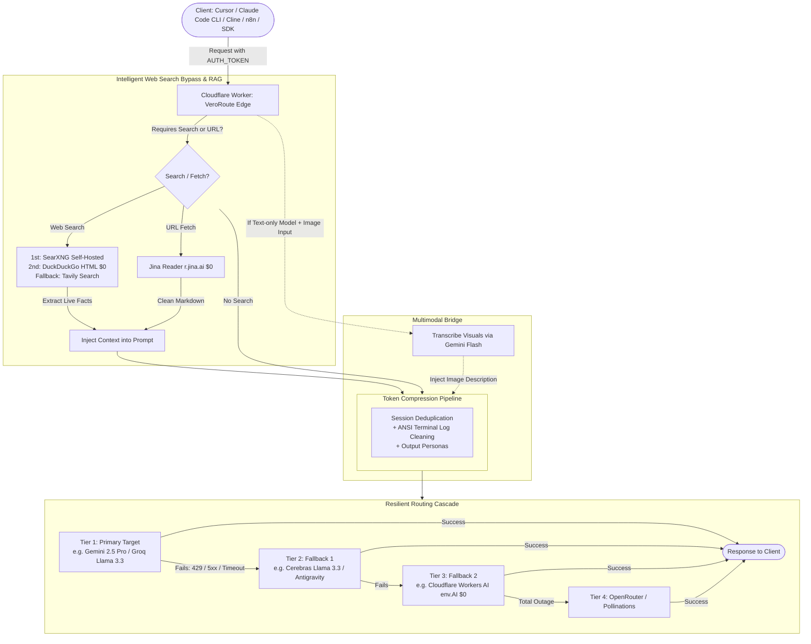

<div align="center">

# ⚡ VeroRoute Edge

### Aerodynamic Serverless AI Gateway & Smart Router for Cloudflare Workers with Resilient Cascade, Real Free-Tier Web Search (RAG) & Multimodal Bridge
### Gateway de IA Serverless Aerodinâmico e Roteador Inteligente para Cloudflare Workers com Cascata de Resiliência, Busca Web Real Gratuita (RAG) e Ponte Multimodal

[](https://deploy.workers.cloudflare.com/?url=https://github.com/samucamg/veroroute-edge)

[](https://www.typescriptlang.org/)
[](https://workers.cloudflare.com/)
[](https://hono.dev/)
[](deploy/searxng/docker-compose.yml)
[](deploy/searxng/portainer-stack.yml)
[](#-endpoint-matrix)
[](#-endpoint-matrix)
[](LICENSE)

**[🇺🇸 English](#english) · [🇧🇷 Português](#portugues)**

</div>

---

<a id="english"></a>
# 🇺🇸 English

## ✨ Overview

**VeroRoute Edge** is an enterprise-grade, edge-native AI gateway and smart router that runs 100% on **Cloudflare Workers (V8 Isolates)**. Inspired by the routing robustness of **OmniRoute** and the token-compression architecture of **VeroRoute**, it delivers sub-15ms proxy latency with zero physical servers.

It features an automatic **resilience cascade** with smart fallbacks (HTTP 429/5xx), global key-pool cooldowns persisted in Cloudflare KV, dual OpenAI + Anthropic specification compatibility, multimodal image transcription for text-only models, and **Search-Augmented Generation (SAG)** with real free-tier search engines (SearXNG, DuckDuckGo HTML, Tavily, Jina Reader).



---

## 🚀 One-Click Deploy to Cloudflare Workers

The fastest way to deploy your own global AI gateway. No local terminal or Wrangler installation required:

<div align="center">

[](https://deploy.workers.cloudflare.com/?url=https://github.com/samucamg/veroroute-edge)

</div>

### Automated Setup Flow:
1. Click the **Deploy to Cloudflare** button above.
2. Authorize Cloudflare to connect to your GitHub account.
3. Cloudflare will automatically fork/clone the repository and deploy the Worker globally across 300+ edge locations.
4. Go to your Worker settings and create the two KV Namespaces (`OMNI_CACHE` and `OMNI_KEYS`).

---

## 🗺️ Endpoint Matrix

| Method | Endpoint | Compatibility | Description |
|---|---|---|---|
| `GET` | `/` | Gateway | Visual Glassmorphism Dashboard & Playground |
| `GET` | `/health` | Gateway | Health check, architecture status and engine version |
| `GET` | `/v1/models` | OpenAI-style | Unified active models catalog, pricing and context lengths |
| `POST` | `/v1/chat/completions` | OpenAI | Chat completions, vision input, tool calling & SSE streaming with cascade |
| `POST` | `/v1/responses` | OpenAI | Structured Responses API and reasoning parameters |
| `POST` | `/v1/messages` | Anthropic | Native Anthropic Messages API (Claude Code CLI, Cline, Cursor, Roo Code) |
| `POST` | `/v1/images/generations` | OpenAI | Image generation via Workers AI (FLUX) with fallback |
| `POST` | `/v1/images/edits` | OpenAI | Image editing and variation endpoint |
| `POST` | `/v1/audio/speech` | OpenAI | Multi-engine text-to-speech (Workers AI / OpenAI) |
| `POST` | `/v1/audio/transcriptions` | OpenAI | Audio transcription via Workers AI Whisper |
| `POST` | `/v1/audio/translations` | OpenAI | Audio translation to English |
| `POST` | `/v1/search` | Gateway | Dedicated web search hub (SearXNG ➔ DuckDuckGo ➔ Tavily) |
| `POST` | `/v1/web/fetch` | Gateway | Dedicated URL scraper via Jina Reader (`r.jina.ai`) to clean Markdown |
| `GET` | `/api/mcp/sse` | MCP Server | Model Context Protocol SSE transport |
| `POST` | `/api/mcp/messages` | MCP Server | Model Context Protocol JSON-RPC 2.0 tool execution |

---

## 🔍 Web Search & RAG: Real Free-Tier Providers

| Provider | Type | Free Tier | Setup | Credit Card? |
|---|---|---|---|:---:|
| **SearXNG** | Search | **100% Free ($0)**, Unlimited | Self-hosted via included [Docker Compose / Portainer](deploy/searxng/) | ❌ **No** |
| **DuckDuckGo HTML** | Search | **100% Free ($0)**, Unlimited | Native edge scraper, zero keys needed | ❌ **No** |
| **Jina Reader (`r.jina.ai`)** | Web Fetch | **100% Free ($0)**, Unlimited | Converts any webpage to clean Markdown | ❌ **No** |
| **Tavily Search** | Search | **1,000 queries/month free** | Free key at [tavily.com](https://tavily.com) | ❌ **No** |

---

## 🐳 Self-Hosted SearXNG (Docker & Portainer Stack)

Included in [deploy/searxng/](deploy/searxng/):

### Option 1: Docker Compose (CLI)
```bash
cd deploy/searxng
docker compose up -d
```

### Option 2: Portainer Stack (Web UI)
1. In Portainer, go to **Stacks** ➔ **Add stack**.
2. Name the stack: `searxng-gateway`.
3. Copy and paste the contents of [`deploy/searxng/portainer-stack.yml`](deploy/searxng/portainer-stack.yml).
4. Click **Deploy the stack**.
5. In your Cloudflare Worker, set the public environment variable (`wrangler.jsonc` `vars` or Dashboard ➔ Settings ➔ Variables):
   ```jsonc
   "SEARXNG_URL": "http://YOUR_SERVER_IP:8080"
   ```
   *(This is a public open URL variable, not a secret key).*

---

---

## ⚙️ Environment Variables & Secrets

> 💡 **All API keys and secrets are 100% optional!**
> You do **NOT** need to configure every provider. Providing just **one single API key** is enough (or none at all, relying on the built-in **free Cloudflare Workers AI** and **DuckDuckGo HTML search**). The gateway automatically routes and falls back across whichever providers you configure.

### 🔒 Secrets & API Keys (`.dev.vars` / Cloudflare Secrets)
*Set only what you plan to use:*
| Secret / Key | Required? | Description |
|---|:---:|---|
| **`AUTH_TOKEN`** | Optional | Master bearer token to protect your gateway. Leave blank for open access. |
| **`GEMINI_API_KEYS`** | Optional | Google Gemini API keys (comma-separated for pool rotation). |
| **`GROQ_API_KEYS`** | Optional | Groq Cloud API keys for ultra-fast Llama 3.3. |
| **`CEREBRAS_API_KEYS`** | Optional | Cerebras Cloud API keys (2,000+ tokens/s). |
| **`OPENAI_API_KEYS`** | Optional | Official OpenAI keys for GPT or audio fallbacks. |
| **`TAVILY_API_KEYS`** | Optional | Tavily web search API key (1,000 free queries/month). |

### 🌐 Open Variables (`wrangler.jsonc` `vars` — Public Text)
*SearXNG URL is a **public variable** (not a secret):*
| Variable | Default | Description |
|---|---|---|
| **`SEARXNG_URL`** | `""` (empty) | URL of your self-hosted SearXNG (e.g. `http://your-server-ip:8080`). Empty = auto DuckDuckGo ($0 free). |
| **`DEFAULT_ROUTING_STRATEGY`** | `priority` | Routing strategy (`priority`, `round-robin`, `p2c`, etc.). |
| **`ENABLE_MODALITY_BRIDGE`** | `true` | Automatic vision-to-text bridge via Gemini / Workers AI. |
| **`ENABLE_CONTEXT_COMPRESSION`** | `true` | Token saver: message deduplication and terminal log cleanup. |
| **`ENABLE_JINA_READER`** | `true` | Clean Markdown web fetcher via `r.jina.ai` ($0 free). |

<a id="portugues"></a>
# 🇧🇷 Português

## ✨ Visão Geral

O **VeroRoute Edge** é um gateway de IA serverless e roteador inteligente projetado para operar 100% na borda global da **Cloudflare (V8 Isolates)**. Inspirado no ecossistema e estratégias de roteamento do **OmniRoute** e na economia de tokens do **VeroRoute**, ele oferece proxy de altíssima velocidade (< 15ms) com zero servidores físicos ou containers dedicados.

Conta com uma **cascata de resiliência inteligente** com fallback automático (HTTP 429, 5xx ou timeout), pool de chaves com cooldowns sincronizados via Cloudflare KV, compatibilidade dupla (OpenAI + Anthropic), transcrição automática de imagens para modelos text-only e **Busca Web em Tempo Real (RAG Integrado)** com provedores de free tier real (SearXNG, DuckDuckGo HTML, Tavily, Jina Reader).

---

## 🚀 Deploy em 1 Clique na Cloudflare

A maneira mais rápida e fácil de colocar seu gateway no ar. Não requer terminal, clone local nem instalação do Wrangler:

<div align="center">

[](https://deploy.workers.cloudflare.com/?url=https://github.com/samucamg/veroroute-edge)

</div>

### Passo a Passo:
1. Clique no botão **Deploy to Cloudflare** acima.
2. Conecte sua conta do GitHub para autorizar o fork/clone automático.
3. A Cloudflare fará o build e publicação instantânea em mais de 300 data centers no mundo.
4. No painel do Worker, crie os dois KV Namespaces (`OMNI_CACHE` e `OMNI_KEYS`).

---

## 🗺️ Matriz de Endpoints

| Método | Endpoint | Compatibilidade | Descrição |
|---|---|---|---|
| `GET` | `/` | Gateway | Dashboard moderno em Glassmorphism e Playground interativo |
| `GET` | `/health` | Gateway | Health check, status da arquitetura e versão |
| `GET` | `/v1/models` | OpenAI-style | Catálogo unificado de modelos ativos, preços e context length |
| `POST` | `/v1/chat/completions` | OpenAI | Chat, visão multimodal, tool calling e streaming SSE com cascata |
| `POST` | `/v1/responses` | OpenAI | Responses API estruturada com suporte a reasoning |
| `POST` | `/v1/messages` | Anthropic | Endpoint nativo Anthropic (Claude Code CLI, Cline, Cursor, Roo Code) |
| `POST` | `/v1/images/generations` | OpenAI | Geração de imagens via Workers AI (FLUX) com fallback automático |
| `POST` | `/v1/images/edits` | OpenAI | Edição e variação de imagem com prompt |
| `POST` | `/v1/audio/speech` | OpenAI | Conversão de texto em fala (TTS) multi-engine |
| `POST` | `/v1/audio/transcriptions` | OpenAI | Transcrição de áudio multipart via Workers AI Whisper |
| `POST` | `/v1/audio/translations` | OpenAI | Tradução de áudio para o inglês |
| `POST` | `/v1/search` | Gateway | Hub dedicado de busca web (SearXNG ➔ DuckDuckGo ➔ Tavily) |
| `POST` | `/v1/web/fetch` | Gateway | Extrator de URLs em Markdown limpo via Jina Reader (`r.jina.ai`) |
| `GET` | `/api/mcp/sse` | Servidor MCP | Transporte SSE do Servidor MCP |
| `POST` | `/api/mcp/messages` | Servidor MCP | Execução de ferramentas via JSON-RPC 2.0 |

---

## 🔍 Busca Web & RAG: Provedores com Free Tier Real (Sem Cartão)

| Provedor | Função | Cota Gratuita | Como Configurar | Cartão de Crédito? |
|---|---|---|---|:---:|
| **SearXNG** | Busca Web | **100% Grátis ($0)**, Ilimitado | Auto-hospedado via [Docker Compose / Portainer](deploy/searxng/) | ❌ **Não** |
| **DuckDuckGo HTML** | Busca Web | **100% Grátis ($0)**, Ilimitado | Scraper nativo na borda, sem chave | ❌ **Não** |
| **Jina Reader (`r.jina.ai`)** | Leitura de URL | **100% Grátis ($0)**, Ilimitado | Converte páginas web em Markdown limpo | ❌ **Não** |
| **Tavily Search** | Busca Web | **1.000 buscas/mês grátis** | Chave gratuita em [tavily.com](https://tavily.com) | ❌ **Não** |

---

## 🐳 Suba seu próprio SearXNG (Docker Compose e Portainer Stack)

Arquivos prontos disponíveis na pasta [`deploy/searxng/`](deploy/searxng/):

### Opção 1: Via Docker Compose (Terminal)
```bash
cd deploy/searxng
docker compose up -d
```

### Opção 2: Via Portainer Stack (Interface Web)
1. No Portainer, acesse **Stacks** ➔ **Add stack**.
2. Nomeie a stack como: `searxng-gateway`.
3. Copie e cole o conteúdo de [`deploy/searxng/portainer-stack.yml`](deploy/searxng/portainer-stack.yml).
4. Clique em **Deploy the stack**.
5. No seu Worker, adicione a URL como **variável pública** (`wrangler.jsonc` `vars` ou Settings ➔ Variables no painel):
   ```jsonc
   "SEARXNG_URL": "http://IP_DO_SEU_SERVIDOR:8080"
   ```
   *(Não precisa ser segredo; é apenas a URL HTTP do seu buscador).*

---

---

## 🔀 Combos de Roteamento Inteligente (O Nome do Combo é o Modelo)

No VeroRoute Edge, **o nome do combo atua diretamente como o identificador do modelo**. Ao enviar uma requisição com `"model": "nome-do-combo"`, o gateway executa a cascata entre os alvos cadastrados de acordo com a estratégia definida:

| Combo Padrão | Estratégia | Modelos e Provedores na Cascata |
| :--- | :--- | :--- |
| `omni-free` | Prioridade / Failover | Gemini 2.5 Flash ➔ Groq ➔ Cerebras ➔ Cloudflare AI ➔ OpenRouter ➔ Pollinations |
| `omni-code` | Prioridade / Failover | Antigravity Gemini 2.5 Pro ➔ 1min.ai GPT-4o ➔ Qwen 2.5 Coder ➔ Groq ➔ Cerebras |
| `omni-fast` | P2C Load-Balance | Cerebras (2.000 t/s) + Groq (500 t/s) balanceado por menor carga |

### 🛠️ Gerenciamento de Combos no Dashboard:
1. Acesse a aba **Combos & Quotas** no Dashboard.
2. Clique em **+ Novo Combo** para definir o identificador do modelo (ex: `combo-super-payload`), descrição e estratégia (`priority`, `round-robin`, `p2c`, `lowest-cost`, `random`).
3. Adicione ou exclua modelos da lista a qualquer momento.
4. Clique em **▶️ Testar Modelos** para realizar testes de ping/latência em tempo real de cada modelo do combo.

---

## 🤖 Integração com DeepSeek Harness (DSH)

O **DeepSeek Harness (`dsh`)** é o framework oficial e modular de orquestração de agentes autônomos da DeepSeek AI (`npx @deepseek-ai/dsh web` ou CLI `dsh`).

### Como Usar com o VeroRoute Edge:
```bash
# 1. Aponte os endpoints do DSH para o seu Worker:
export OPENAI_BASE_URL="https://seu-worker.workers.dev/v1"
export OPENAI_API_KEY="sk-vr-seu-token" # Chave virtual do painel ou AUTH_TOKEN
export DEEPSEEK_API_BASE="https://seu-worker.workers.dev/v1"

# 2. Inicie o DeepSeek Harness passando qualquer Combo como modelo:
npx @deepseek-ai/dsh web --model omni-code

# Ou utilize combos customizados via CLI:
dsh --model combo-super-payload
```

---

## 🔐 Conexão OAuth com Antigravity CLI & Solução GitHub Secret Scanning

O GitHub possui um scanner automatizado que **bloqueia commits contendo segredos do Google OAuth** (`GOCSPX-...`). Para manter seu repositório 100% seguro e sem bloqueios de commit:

1. **Configuração via Painel de Administração:**
   - Acesse o Dashboard na aba **Antigravity OAuth**.
   - Insira o seu `Client ID` e `Client Secret` do Google Cloud Code Assist.
   - Clique em **Salvar Credenciais no KV OMNI_KEYS**.
   - As credenciais ficam salvas estritamente no seu Cloudflare KV, sem nunca tocar no código Git.
2. **Configuração via Cloudflare Secrets (Wrangler):**
   ```bash
   npx wrangler secret put ANTIGRAVITY_CLIENT_ID
   npx wrangler secret put ANTIGRAVITY_CLIENT_SECRET
   ```
3. **Importação Manual de Tokens (Sem Navegador):**
   - Cole o conteúdo de `~/.config/antigravity/tokens.json` ou seu `refresh_token` na área de importação do painel para conexão imediata com os modelos Claude 3.7 Sonnet e Gemini 2.5 Pro.

---

## ⚙️ Variáveis de Ambiente e Segredos

> 💡 **Todas as chaves de API e segredos são 100% opcionais!**
> Você **NÃO** precisa preencher todas as chaves de API. Configure apenas **uma única chave** do provedor que desejar (ou nenhuma, utilizando o **Cloudflare Workers AI nativo gratuito** e o **DuckDuckGo** que funcionam sem chave alguma). O gateway direciona e faz fallback automaticamente para os provedores configurados.

### 🔒 Segredos e Chaves (`.dev.vars` / Cloudflare Secrets)
*Adicione apenas o que você for utilizar:*
| Chave / Segredo | Obrigatório? | Descrição |
|---|:---:|---|
| **`AUTH_TOKEN`** | Opcional | Senha mestra para proteger o seu gateway. Se vazio, o acesso fica público. |
| **`ANTIGRAVITY_CLIENT_SECRET`** | Opcional | Client Secret do Google OAuth (evite commitar no git; use o painel ou secret). |
| **`ANTIGRAVITY_CLIENT_ID`** | Opcional | Client ID do Google OAuth para o Antigravity CLI. |
| **`GEMINI_API_KEYS`** | Opcional | Chaves do Google Gemini (AI Studio). Múltiplas chaves separadas por vírgula. |
| **`GROQ_API_KEYS`** | Opcional | Chaves da Groq Cloud para modelos ultrarrápidos (Llama 3.3). |
| **`CEREBRAS_API_KEYS`** | Opcional | Chaves da Cerebras Cloud (> 2.000 t/s). |
| **`OPENAI_API_KEYS`** | Opcional | Chaves oficiais da OpenAI para fallback de áudio/TTS ou GPT. |
| **`TAVILY_API_KEYS`** | Opcional | Chave de busca web da Tavily (1.000 buscas/mês grátis). |

### 🌐 Variáveis Públicas de Ambiente (`wrangler.jsonc` `vars` — Texto Aberto)
*A URL do SearXNG é uma **variável pública** (não é segredo/chave). Configure apenas se tiver uma instância própria:*
| Variável | Padrão | Descrição |
|---|---|---|
| **`SEARXNG_URL`** | `""` (vazio) | URL da sua instância SearXNG (ex: `http://seu-ip:8080`). Se deixar vazio, usa **DuckDuckGo HTML gratuito ($0 sem chave)**. |
| **`DEFAULT_ROUTING_STRATEGY`** | `priority` | Estratégia de balanceamento (`priority`, `round-robin`, `p2c`, etc.). |
| **`ENABLE_MODALITY_BRIDGE`** | `true` | Transcreve imagens para texto em modelos text-only via Gemini/Workers AI. |
| **`ENABLE_CONTEXT_COMPRESSION`** | `true` | Ativa deduplicação e limpeza de logs de terminal para economia de tokens. |
| **`ENABLE_JINA_READER`** | `true` | Ativa extração de páginas web em Markdown limpo via `r.jina.ai` ($0 grátis). |

---

## 📄 Licença

Distribuído sob licença MIT. Veja [LICENSE](LICENSE) para detalhes.
